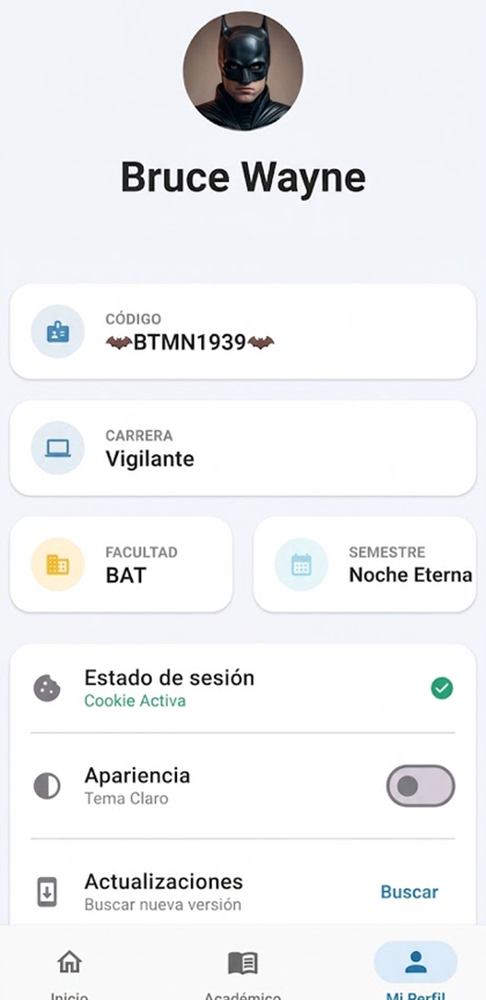
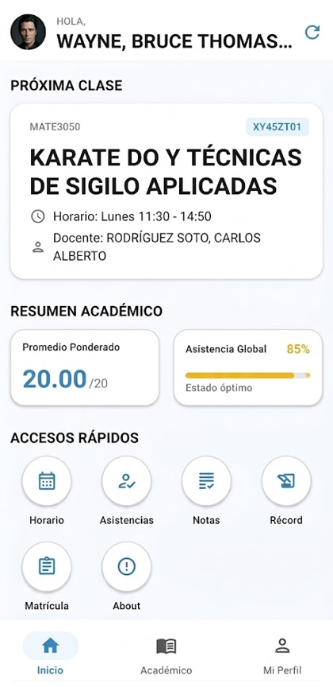
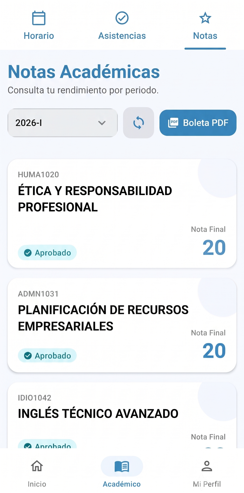

# 🎓 Campus - UNPRG

  <b>Aplicación móvil moderna, ágil e intuitiva para la comunidad estudiantil de la Universidad Nacional Pedro Ruiz Gallo.</b>

  
  
  

---

> ### ⚠️ Aviso de Independencia y No Oficialidad
> **Esta aplicación es un proyecto independiente desarrollado sin fines de lucro, creado por diversión de estudiantes para estudiantes.**  
> No cuenta con respaldo, patrocinio ni vinculación oficial con la **Universidad Nacional Pedro Ruiz Gallo (UNPRG)**, ni pertenece a ningún partido, agrupación o movimiento estudiantil o político. El uso de nombres o isotipos es meramente identificativo para la comunidad universitaria.

---

## 📸 Capturas de la Aplicación

  
  
  

---

## 📲 Descargar la Aplicación

Puedes descargar directamente el instalador oficial de la aplicación desde la sección de Releases:

👉 **[Descargar Último APK Oficial (GitHub Releases)](https://github.com/Juklein-Von/Releases-Campus/releases/latest)**

---

## ✨ Características Principales

- 📅 **Horario de Clases**: Visualización organizada de cursos, docentes y aulas asignadas para tu ciclo académico.
- 📊 **Monitoreo de Asistencias**: Consulta de clases asistidas, faltas acumuladas y cálculo preventivo del límite permitido para no inhabilitarte.
- 📝 **Mis Notas en Tiempo Real**: Visualización clara de notas por unidad y cálculo automático de promedios ponderados.
- 🎓 **Récord Académico y Boletas**: Historial consolidado, conteo de créditos y descarga directa de boletas de matrícula en PDF.
- 🔄 **Actualizador Integrado (In-App)**: Detección y descarga automática de nuevas versiones directamente desde la app, sin necesidad de Play Store.
- 🎨 **Diseño Moderno y Adaptable**: Desarrollada en Jetpack Compose con soporte completo para Tema Claro y Tema Oscuro.

---

## 🛠️ Guía Rápida de Instalación

1. Entra a **[Releases](https://github.com/Juklein-Von/Releases-Campus/releases/latest)** y descarga el archivo `.apk` más reciente.
2. Abre el archivo descargado en tu dispositivo Android.
   - *Si tu teléfono lo solicita, permite la instalación de fuentes desconocidas desde tu navegador o explorador de archivos.*
3. Abre la aplicación e inicia sesión con tu cuenta institucional.

---

## 🔒 Privacidad y Seguridad de Datos

- **Conexión Directa**: Tus credenciales y datos viajan de manera encriptada y directa entre tu dispositivo y los servidores de la intranet universitaria.
- **Sin Intermediarios**: La aplicación no almacena ni recopila contraseñas, correos ni notas en servidores externos de terceros. Todo funciona de forma local en tu teléfono.

---

  Desarrollado para la comunidad universitaria UNPRG 🏛️

